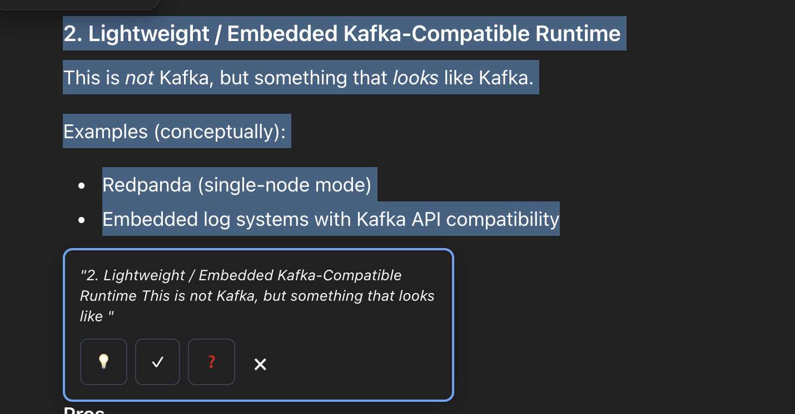
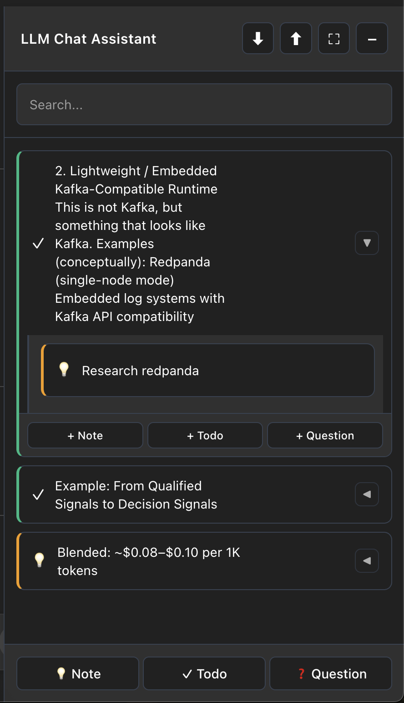

# LLM Chat assistant 🌳

> Capture, organize, and manage your research findings from Claude, ChatGPT, and Gemini

[](https://chrome.google.com/webstore)
[](https://github.com/sakshij/llm-chat-assistant)
[](LICENSE)

## 📖 Overview

LLM chat assistant is a lightweight Chrome extension that helps researchers, students, and professionals organize insights from AI conversations. Capture important findings, todos or mark deep dives for later with a simple text selection, organize them systematically, and never lose track of valuable research again.

**Key Features:**
- 💡 Instant capture from text selection
- 📝 Three item types: Notes, Todos, Questions
- 🔗 Jump back to original context
- 🔍 Real-time search and filtering
- 💾 Import/export as JSON
- 🌙 Dark mode support
- 🚀 100% local - no backend required

---

## 🎯 Why LLM Chat Assistant?

When working with AI chatbots like Claude, ChatGPT, or Gemini, valuable insights can get lost in long conversations. Research Tree solves this by letting you:

1. **Capture instantly** - Select text, click a button, done
2. **Organize naturally** - Group related findings under parent items
3. **Find quickly** - Search across all your notes in real-time
4. **Jump to context** - Click the 🔗 icon to scroll back to the original message
5. **Work privately** - All data stored locally in your browser

Perfect for:
- 📚 Academic research
- 💼 Professional documentation
- 🧪 Technical exploration
- ✍️ Creative writing projects
- 🎓 Learning and note-taking

---

## 📸 Screenshots

### Text Selection Popup

*Select 4+ words to capture findings instantly*

### Organized Research Tree

*Your findings organized hierarchically with search*

---

## 🚀 Installation

### From Chrome Web Store (Recommended)
1. Visit [LLM chat assistant on Chrome Web Store](#) *(coming soon)*
2. Click "Add to Chrome"
3. Start using on Claude.ai, ChatGPT, or Gemini

### Manual Installation (Development)
1. Download or clone this repository
   ```bash
   git clone https://github.com/sakshij/llm-chat-assistant
   cd llm-chat-assistant
   ```

2. Open Chrome and navigate to `chrome://extensions/`

3. Enable "Developer mode" (toggle in top-right)

4. Click "Load unpacked"

5. Select the `llm-chat-assistant` folder

6. The extension is now installed! Visit Claude.ai, ChatGPT or Gemini to start using it

---

## 🎨 How to Use

### 1. Capture from Text Selection
1. On Claude.ai, ChatGPT, or Gemini, select any text (4+ words)
2. A popup appears with three options:
   - 💡 **Note** - General findings or insights
   - ✓ **Todo** - Action items or tasks
   - ❓ **Question** - Follow-up questions
3. Click the appropriate button to save

### 2. Add Items Manually
- Click the footer buttons (💡 Note, ✓ Todo, ❓ Question)
- Type your content in the inline text box
- Press ✓ to save or ✕ to cancel

### 3. Organize with Children
- Each root item can have up to 20 child items
- Click "+ Note", "+ Todo", or "+ Question" under any root item

### 4. Navigate to Source
- Items captured from text selection show a 🔗 icon
- Click it to auto-scroll to the original text
- The text highlights briefly for easy identification

### 5. Search Your Research
- Use the search box at the top
- Results filter in real-time
- Search across all item text

### 6. Resize the Sidebar
- Hover over the left edge of the sidebar
- Drag to resize width
- Your preferred size is maintained

### 7. Export & Import
- Click ⬇ in the header to export as JSON
- Click ⬆ to import previously saved data
- Great for backups or moving between devices

---

## 🗂️ Data Organization

### Storage Scope
- **Within a project**: Items are shared across all chats
- **No project**: Each chat has isolated items
- **Different projects**: Separate item collections

### Storage Location
All data is stored locally in your browser using `localStorage`:
- No cloud sync
- No external servers
- Complete privacy

### Limits
| Feature | Limit |
|---------|-------|
| Total items per chat | 100 |
| Children per parent | 20 |
| Nesting levels | 1 (no grandchildren) |
| Storage per domain | ~10MB |

---

## 🛠️ Technical Details

### Built With
- **Vanilla JavaScript** - No external dependencies
- **CSS3** - Modern styling with CSS variables
- **Chrome Extension API** - Manifest V3
- **localStorage** - Client-side persistence

### Browser Support
- ✅ Chrome/Chromium (primary)
- ✅ Microsoft Edge
- ✅ Brave
- ⚠️ Firefox (requires adaptation)
- ⚠️ Safari (requires adaptation)

### File Structure
```
llm-chat-assistant/
├── manifest.json          # Extension configuration
├── content-script.js      # Main logic (23KB)
├── styles.css            # Styling (10KB)
├── background.js         # Service worker
├── icons/                # Extension icons
│   ├── icon-16.png
│   ├── icon-32.png
│   ├── icon-48.png
│   └── icon-128.png
└── README.md             # This file
```

---

## 🔒 Privacy & Permissions

### What We Access
- ✅ **Page content** - To detect text selection on LLM sites
- ✅ **localStorage** - To save your research locally
- ✅ **DOM manipulation** - To inject the sidebar UI

### What We DON'T Do
- ❌ No data collection
- ❌ No external servers
- ❌ No analytics or tracking
- ❌ No cloud sync
- ❌ No account required

**Your research stays on your device, period.**

### Required Permissions
- `storage` - Save data locally
- `scripting` - Inject sidebar on LLM pages
- `activeTab` - Detect current page context

---

## 🤝 Contributing

Contributions are welcome! Here's how you can help:

### Report Bugs
Open an issue with:
- Clear description of the problem
- Steps to reproduce
- Expected vs actual behavior
- Browser version and OS

### Suggest Features
Open an issue with:
- Feature description
- Use case / motivation
- Mockups or examples (if applicable)

### Submit Code
1. Fork the repository
2. Create a feature branch (`git checkout -b feature/amazing-feature`)
3. Commit your changes (`git commit -m 'Add amazing feature'`)
4. Push to the branch (`git push origin feature/amazing-feature`)
5. Open a Pull Request

### Code Style
- Use vanilla JavaScript (no frameworks)
- Follow existing code structure
- Comment complex logic
- Test on Chrome, Edge, and Brave

---

## 📋 Changelog

[View full changelog](CHANGELOG.md)

---

## 📄 License

This project is licensed under the MIT License - see the [LICENSE](LICENSE) file for details.

---

## 🙋 Support

### Need Help?
- 🐛 Report bugs on [GitHub Issues](https://github.com/sakshij/llm-chat-assistant)
- 💬 Ask questions in [Discussions](https://github.com/sakshij/llm-chat-assistant)

### Feedback
We'd love to hear from you! If LLM Chat Assistant has been helpful, consider:
- ⭐ Starring the repository
- 📝 Leaving a review on the Chrome Web Store
- 🐦 Sharing with others who might find it useful

---

## 👨‍💻 Author

Created by [Sakshi Jain](https://github.com/sakshij)

---

## 🙏 Acknowledgments

- Inspired by the needs of researchers and students
- Built for the AI assistant era
- Designed with privacy and simplicity in mind

---

<div align="center">

**[Install Now](#-installation) | [View Demo](#-screenshots) | [Report Bug](https://github.com/sakshij/llm-chat-assistant/issues)**

Made with ❤️ for researchers everywhere

</div>
